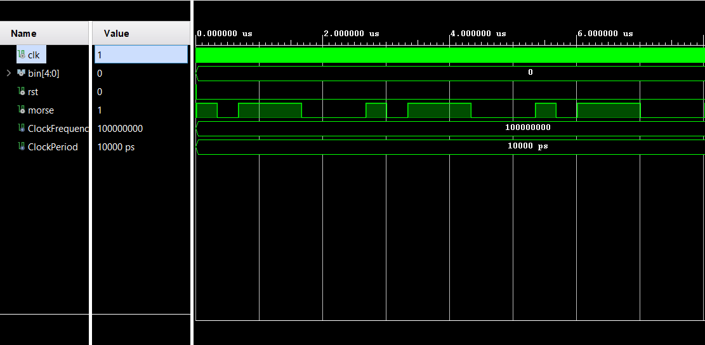
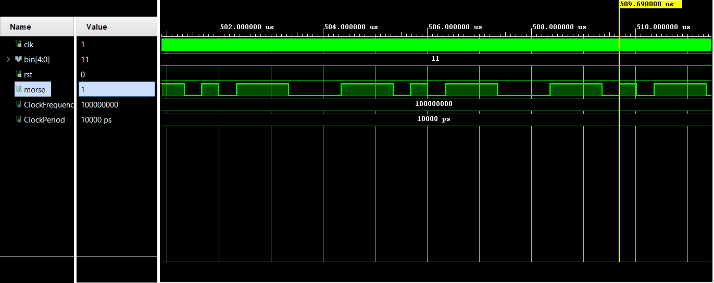

# Morse Code Transmitter
### Team members & responsibilities 
Daniel Graf - mct, top

Lukáš Lipenský - QA, tb

### Theoretical description and explanation

### Hardware description of demo application

### Component(s) simulations
Simulation of MCT module, letter A represented by **.-**

Simulation of MCT module, letter K represented by **-.-**

### Instructions

### References
