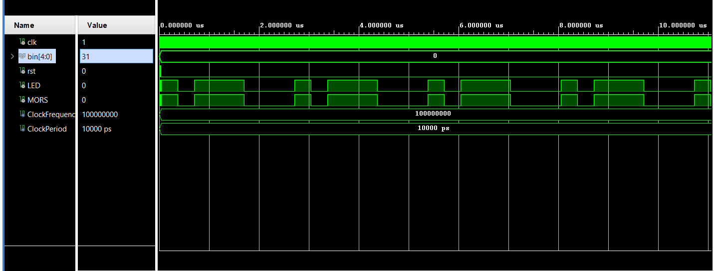
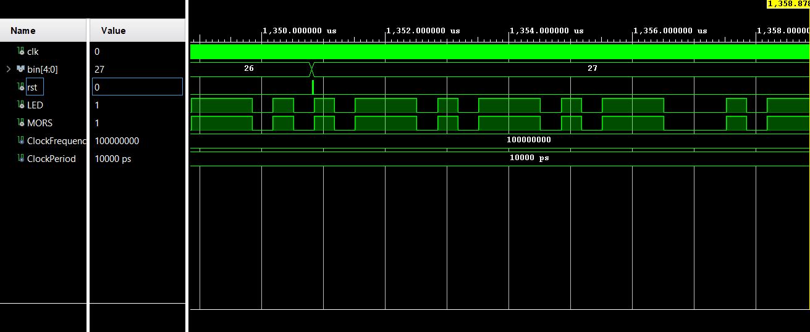

# Morse Code Transmitter
### Team members & responsibilities 
Daniel Graf - mct, top

Lukáš Lipenský - QA, tb

### Theoretical description and explanation

### Hardware description of demo application

### Software description
[Source files](https://github.com/DanielGraf240616/digital-electronics-1/tree/main/MCT_project/DE1_project_MCT/DE1_project_MCT.srcs/sources_1/new)
[Testbench files](https://github.com/DanielGraf240616/digital-electronics-1/tree/main/MCT_project/DE1_project_MCT/DE1_project_MCT.srcs/sim_1/new)
### Component(s) simulations
Simulation of the MCT module, letter A represented by **.-**

Simulation of the MCT module, letter K represented by **-.-**

Simulation of the TOP module, letter A representd by **.-**

Simulation of the TOP module, dot representd by **.-.-.-**

### Instructions
The MCT is operated by 5 switches on far right and the middle BTNC button.

User inputs desired letter in 5 bit binary form by toggling switches (up- 1, down- 0) and then confirms by pressing the BTNC button which submits the input, after that the RGB led should start blinking depending on the input. BTNC button also works as a reset button, if user holds the button, the led gets turned off. Morse signal is also transmitted by pin 1 of JD. All buttons/ switches/ pins are located on the fpga as shown on the image below.
![] (nexys_ui.png)
Input & output chart
 | **Number** | **Letter** | **Binary input** | **Morse code output** |
 | :-: | :-: | :-: | :-: |
   | 0 | 00000 | A |**. -**|
   | 1 | 00001 | B | **- . . .** |
   | 2 | 00010 | C | **- . - .** |
   | 3 | 00011 | D | **- . .** |
   | 4 | 00100 | E | **.** |
   | 5 | 00101 | F | **. . - .** |
   | 6 | 00110 | G | **- - .** |
   | 7 | 00111 | H | **. . . .** |
   | 8 | 01000 | CH | **- - - -**|
   | 9 | 01001 | I | **. .** |
   | 10 | 01010 | J | **. - - -** |
   | 11 | 01011 | K | **- . -** |
   | 12 | 01100 | L | **. - . .** |
   | 13 | 01101 | M | **- -** |
   | 14 | 01110 | N | **- .** |
   | 15 | 01111 | O | **- - -** |
   | 16 | 10000 | P | **. - - .** |
   | 17 | 10001 | Q | **- - . -** |
   | 18 | 10010 | R | **. - .** |
   | 19 | 10011 | S | **. . .**  |
   | 20 | 10100 | T | **-** |
   | 21 | 10101 | U | **. . -** |
   | 22 | 10110 | V | **. . . -** |
   | 23 | 10111 | W | **. - -** |
   | 24 | 11000 | X | **- . . -** |
   | 25 | 11001 | Y | **- . - -** | 
   | 26 | 11010 | Z | **- - . .** |
   | 27 | 11011 | Tečka | **. - . - . -**|
   | 28 | 11100 | Otažník | **. . - - . .** |
   | 29 | 11101 | Vykřičník | **- - . . . -** |
   | 30 | 11110 | Čárka | **- - . . - -** |
   | 31 | 11111 | Dvojtečka | **- - - . . .**  |
   
   
### References
